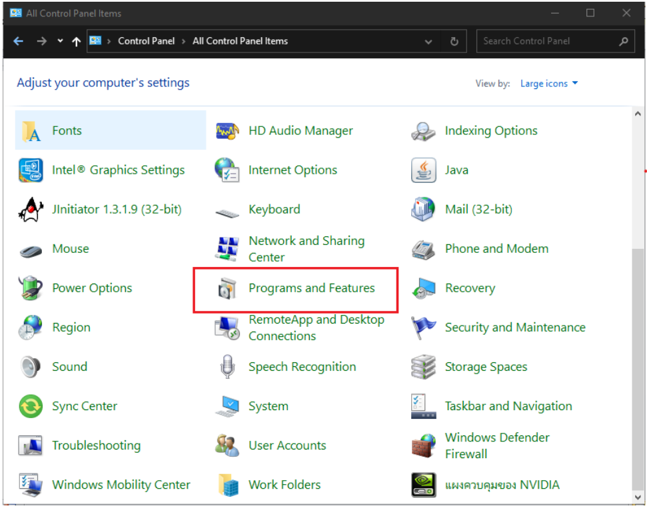
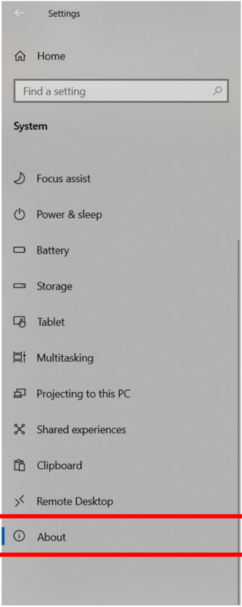
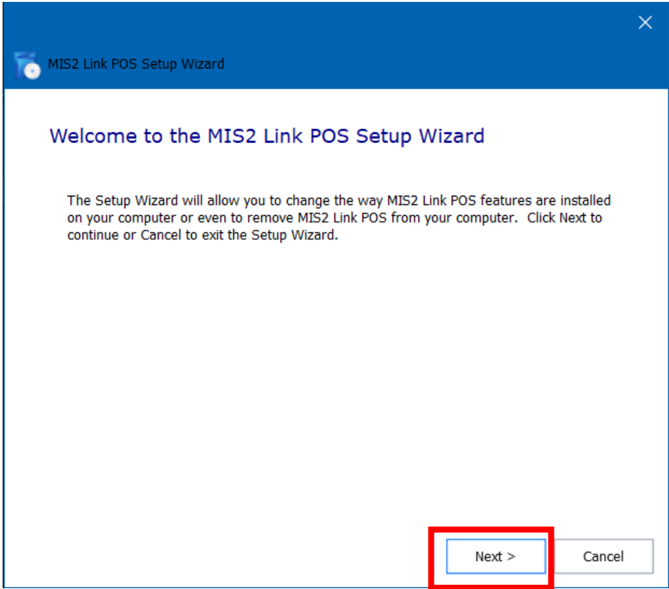

## คู่มือการติดตั้งเครื่องเพื่อให้เครื่องของผู้ใช้งานชําระเงินผ่านบัตรเครดิตได้ (MIS2 Link POS Version

## 1.1.0)

- 1. Software Requirement
- 1.1. Windows XP, Windows 7 (32-bit และ 64 -bit) หรือ Windows 10 (32-bit และ 64 -bit) ( วิธี ตรวจสอบเวอร์ชั่นของ Windows ตามข้อ 4.)
- 1.2. JRE runtime ต้องมีเพื่อให้ผู้ใช้ สามารถรัน oracle form ได้ ต้องทําการติดตั้งก่อนกรณีที่ยังไม่ สามารถรัน oracle form ได้ หรือ download ได้ที่ http://misweb.bma.go.th/download/MISEDCTEMP/ jdk-6u45-windows-i586.exe
- 1.3. Driver สําหรับเครื่องรูดบัตร (rxtxSerial.dll)

## 2. การติดตั้ง JRE runtime ( กรณีไม่สามารถเข้าระบบการเงินรับได้)

- 2.1. ทําการ download โปรแกรม JRE runtime ให้ผู้ใช้งานเข้าไปที่หน้าเขียว

http://misweb.bma.go.th/ และทําการ download โปรแกรม โดยให้กดที่คําว่า Download Java JDK ตรงด้านล่างซ้ายมือตรงหน้าเขียวดังภาพ หรือ Download จาก

http://misweb.bma.go.th/download/MISEDCTEMP/java\_jdk6.exe

## 2.2. เมื่อคลิ้กที่ Download Jre จะปรากฏหน้าจอดังภาพ ให้กดปุ ่ ม Save

## 2.3. เมื่อทําการ Download เรี ยบร้อยแล้วให้ทําการติดตั้งโดยการดับเบิ้ลคลิกที่ไฟล์ดังกล่าว

## จะปรากฏหน้าจอดังภาพ แล้วทําการกดปุ ่ ม Next

## 2.4. จะปรากฏหน้าจอดังภาพ ทําการกดปุ ่ ม Next

## 2.5. จะปรากฏหน้าจอการติดตั้ง

## 2.6. เมื่อทําการติดตั้งสําเร็จจะปรากฏหน้าจอดังภาพ ทําการกดปุ ่ ม Next

## 2.7. จะปรากฏหน้าจอการติดตั้ง

## 2.8. เมื่อทําการติดตั้งสําเร็จจะปรากฏหน้าจอดังภาพ

2.9. หลังจากนั้นทําการตั้งค่าเพื่อให้เครื่องสามารถใช้งาน java ได้ โดยการคลิ้กขวาที่ My computer

## และเลือก Properties

## 2.10. จะปรากฏหน้าจอตามภาพด้านล่าง จากนั้นให้ผู้ใช้งานคลิกเลือก Advanced system settings

2.11. จากปรากฏหน้าตอด้านล่าง ให้คลิกที่ปุ ่ ม Enviroment Variables

## 2.12. หลังจากที่คลิกที่ปุ ่ ม Enviroment Variables จะปรากฏหน้าจอด้านล่าง ทําการเลือก

variable = Path แล้วกดปุ ่ ม

System Edit

2.13. หลังจากที่เลือกที่ชื่อ Path กดปุ ่ ม Edit แล้วให้ทําการแก้ไข Variable value ของเครื่อง โดยการนํา java path มาไว้ด้านหน้าสุด หรือต่อท้ายสุดของ Variable value ( ไม่ต้องลบค่าเดิมของ Variable value) ในที่นี้ java path คือ C:\Program Files\Java\jdk1.6.0\_45\bin

## จากนั้นกดปุ ่ ม OK จะปรากฏหน้าจอตามภาพด้านล่าง

จากนั้นกดปุ ่ ม OK เพื่อสิ้นสุดการแก้ไข

## 3. วิธีการตรวจสอบเวอร์ชั่นโปรแกรม

## 3.1. เป ิ ดโปรแกรม Control Panel ของ Windows ดังภาพตัวอย่าง

## 3.2. คลิกเป ิ ด 'Programs and Features' ในวงกลมสีแดงดังภาพ

3.3. ตรวจสอบชื่อและเวอร์ชั่นของโปรแกรมดังต่อไปนี้

## 3.3.1. โปรแกรม Driver เครื่องรูดบัตร

หากในเครื่องไม่มีโปรแกรมดังรูป หรือมีโปรแกรมชื่อ 'VeriFone Vx Installer version 1.0.0.37' ให้ทําการติดตั้งโปรแกรม Driver เครื่ องรูดบัตรใหม่ ตามข้อ 4.2

## 3.3.2. โปรแกรมเชื่อมต่อกับเครื่องรูดบัตร (MIS2 Link POS)

หากในเครื่องไม่มีโปรแกรมดังรูป หรือมีโปรแกรมชื่อ 'MIS2 edcCall' หรือ โปรแกรม ชื่อ 'MISEDCTEMP' ให้ทําการติดตั้งโปรแกรมเชื่อมต่อกับเครื่องรูดบัตรใหม่ ตามข้อ 4.1

- 4. ติดตั้ง Driver และโปรแกรมที่เชื่อมต่อกับเครื่องรูดบัตร
- ** โปรดทําการตรวจสอบเวอร์ชั่นของโปรแกรมก่อนทําขั้นตอนนี้ ตามข้อ 3 **
- 4.1. ติดตั้งโปรแกรมที่เชื่อมต่อกับเครื่องรูดบัตร
- ( กรณีในเครื่องมีโปรแกรมที่เชื่อมต่อกับเครื่องรูดบัตร เวอร์ชั่นเก่า เช่น 'MIS2 edcCall' หรือ 'MISEDCTEMP' ให้ถอนการติดตั้งตามข้อ 4.1.1 หน้า 12
- กรณีไม่มีโปรแกรมที่เชื่อมต่อกับเครื่องรูดบัตร ให้ข้ามไปที่ข้อ 4.1.8 หน้า 15 )

เวอร์ชั่นล่าสุดชื่อ

MIS2 Link POS

เวอร์ชั่น

1.1.0

## 4.1.1. เป ิ ดโปรแกรม Control Panel ของ Windows ดังภาพตัวอย่าง

## 4.1.2. คลิกเป ิ ดโปรแกรมในวงกลมสีแดงดังภาพ

## 4.1.3. ดับเบิ้ลคลิกที่โปรแกรม 'MIS2 edcCall' หรือ 'MISEDCTEMP'

## 4.1.4. จะปรากฏหน้าจอดังภาพ จากนั้นคลิก Next

## 4.1.5. จะปรากฏหน้าจอดังภาพ จากนั้นเลือก Remove

## 4.1.6. จะปรากฏหน้าจอดังภาพ จากนั้นคลิก Remove

## 4.1.7. จะปรากฏหน้าจอดังภาพ จากนั้นคลิก Finish

4.1.8. ทําการดาวน์โหลดโปรแกรม จากหน้าเขียว http://misweb.bma.go.th/ หรือเข้า link

โดยตรง http://misweb.bma.go.th/download/MISEDCTEMP/usb/MIS2\_EDC.zip 4.1.9. ทําการแตกไฟล์ MIS2\_EDC.zip ออก จะได้ไฟล์ MIS2 EDC.exe ดังภาพ

4.1.10. ทําการติดตั้ง โดยคลิกที่ MIS2 EDC.exe จะปรากฏหน้าจอดังภาพ จากนั้นกดปุ ่ ม Yes

4.1.11. ทําการติดตั้ง file system โดยดับเบิ้ลคลิกที่ MIS2 EDC.exe จะปรากฏหน้าจอดังภาพ จากนั้นกดปุ ่ ม Next

4.1.12. จะปรากฏหน้าจอดังภาพ จากนั้นเลือก Typical

4.1.13. จะปรากฏหน้าจอดังภาพ จากนั้นกดปุ ่ ม Next

4.1.14. จะปรากฏหน้าจอดังภาพ จากนั้นกดปุ ่ ม Install

## 4.1.15. จะปรากฏหน้าจอดังภาพ

4.1.16. รอจนติดตั้งเสร็จ จะปรากฏหน้าจอ จากนั้นกดปุ ่ ม Finish

## 4.2. ติดตั้ง Driver เครื่ องรูดบัตร

( กรณีในเครื่องมีโปรแกรม Driver เวอร์ชั่นเก่า เช่น โปรแกรม 'VeriFone Vx Installer version 1.0.0.37' ให้ทําการถอนการติดตั้ง ตามข้อ 4.2.1 หน้า 19 กรณีไม่มีโปรแกรม Driver เวอร์ชั่นเก่า ให้ข้ามไปที่ข้อ 4.2.9 หน้า 22 )

## โปรแกรม Driver เวอร์ชั่นล่าสุด

## 4.2.1. เสียบ USB เครื่ องรูดบัตร เป ิ ดโปรแกรม Control Panel ของ Windows ดังภาพตัวอย่าง

4.2.2. เลือก Device Manager

## 4.2.3. ไปที่แถบ Port (COM &amp; LPT) จะมี Port ที่ชื่อ VX 520 GPRS Terminal (COM9) ให้คลิก ขวาแล้วเลือก Uninstall Device

4.2.4. ติ๊กที่ช่อง Delete the driver software for this device แล้วคลิก Uninstall

## 4.2.5. คลิกเป ิ ดโปรแกรมในวงกลมสีแดงดังภาพ

4.2.6. ดับเบิ้ลคลิกที่โปรแกรม 'VeriFone Vx Installer version 1.0.0.37'

## 4.2.7. คลิก Yes

## 4.2.8. คลิก OK

- 4.2.9. ดาวน์โหลด Driver ใหม่ได้ที่หน้าเขียว http://misweb.bma.go.th หรือเข้า link โดยตรง http://misweb.bma.go.th/download/MISEDCTEMP/usb/Driver.rar จากนั้นทําการแตก ไฟล์จะได้ไฟล์ดังภาพ

4.2.10. ดับเบิ้ลคลิกไฟล์ดังกล่าว จะพบ 2 โฟล์เดอร์ ให้ดับเบิ้ลคลิกโฟล์เดอร์ที่ตรงกับเวอร์ชั่น ของ Windows ( ตรวจสอบเวอร์ชั่นของ Windows ตามข้อ 5 หน้า 28 )

## 4.2.11. ดับเบิ้ลคลิกไฟล์ดังภาพเพื่อทําการติดตั้งโปรแกรม

## 4.2.12. จะขึ้นหน้าการติดตั้งโปรแกรมดังรูป คลิก Next

## 4.2.13. คลิก Next

## 4.2.14. คลิก Install

4.2.15. รอการติดตั้งเสร็จสิ้น

## 4.2.16. คลิก Finish

4.3. จากนั้นเสียบเข้ากับเครื่องคอมพิวเตอร์ที่สามารถรันระบบการเงินรับได้ ผ่านสาย USB เสียบปลั้กให้เรียบร้อยจะสามารถใช้โปรแกรมระบบการเงินรับ ส่งข้อมูลให้กับเครื่องรูดบัตรได้

## ** หากไม่สามารถติดต่อกับเครื่องรูดบัตรได้ เบื้องต้นให้ทําการเช็คไฟล์ portName.txt โดยมีวิธีการดังนี้

- -ดับเบิ้ลคลิกไฟล์ portName.txt โดยไฟล์จะอยู่ที่ C:\MISEDCTEMP\log
- -พิมพ์ข้อความ COM แล้วตามด้วยเลข ดังรูป โดยให้ตรงกับ Port ของเครื่อง ใน Device Manager

- -คลิก File &gt; Save
- -หลังจากนั้น ทําการทดสอบเครื่องรูดบัตรอีกครั้งในระบบ

## 5. ขั้ นตอนการตรวจสอบเวอร์ชั่นของ Windows

## 5.1. Windows 7

## 5.1.1. คลิกขวาที่ My Computer จากนั้นคลิกที่ Properties ตามภาพด้านล่าง

## ** กรณีไม่พบไอคอน My Computer บนหน้าจอ ให้คลิกปุ ่ ม Start จากนั้นคลิกขวาที่ Computer แล้วคลิกที่ Properties ตามภาพด้านล่าง

## 5.1.2. จะปรากฏหน้าจอ พร้อมรายละเอียดของ Windows ให้ดูรายละเอียดที่หัวข้อ System type จะบอกเวอร์ชั่นของ Windows ที่ใช้งานอยู่

## 5.2. Windows 10

5.2.1.

คลิกที่

Start

หรือ

แล้วคลิก Setting หรือ

## 5.2.2. คลิกที่ System

## 5.2.3. คลิกที่ About ให้ดูรายละเอียดที่หัวข้อ System type จะบอกเวอร์ชั่นของ Windows ที่ใช้

## งานอยู่

- 6. การถอดการติดตั้งระบบเชื่อมต่อเครื่องรูดบัตร (กรณีเครื่องรูดบัตรไม่สามารถยกเลิกการรับเงินได้) การถอดการติดตั้งโปรแกรมมี 2 วิธี
- 1. ถอนการติดตั้งผ่านโปรแกรม MIS2 EDC.exe (เริ่ มข้อ 5.1 ถึง 5.8)
- 2. ถอนการติดตั้งผ่าน Control Panel ( เริ่ มข้อ 5.9 ถึง 5.14)
- -ถอนการติดตั้งผ่านโปรแกรม MIS2 EDC.exe
- 6.1. เป ิ ดโปรแกรม MIS2 EDC.exe ดังภาพตัวอย่าง

## 6.2. จะปรากฏหน้าจอดังภาพ จากนั้นคลิก Yes

6.3. จะปรากฏหน้าจอดังภาพ จากนั้นคลิก Next

6.4. จะปรากฏหน้าจอดังภาพ จากนั้นเลือก Remove

## 6.5. จะปรากฏหน้าจอดังภาพ จากนั้นคลิก Remove

## 6.6. จะปรากฏหน้าจอดังภาพ

## 6.7. รอถอนติดตั้งเสร็จสิ้น จะปรากฏหน้าจอดังภาพ จากนั้นคลิก Finish

6.8. เมื่อทําการเสร็จสิ้นแล้ว ให้ทําการติดตั้งระบบเชื่อมต่อเครื่องรูดบัตรใหม่อีกครั้งตามขั้นตอนที่ 3.

## -ถอนการติดตั้งผ่าน Control Panel

## 6.9. เป ิ ดโปรแกรม Control Panel ของ Windows ดังภาพตัวอย่าง

## 6.10. คลิกเป ิ ด Program and Features ดังภาพ

## 6.11. ดับเบิ้ลคลิกที่โปรแกรม MISEDCTEMP

## 6.12. จะปรากฏหน้าจอดังภาพ ให้คลิก Yes

## 6.13. จะปรากฏหน้าจอดังภาพ จากนั้นคลิก Yes

6.14. รอถอนติดตั้งเสร็จสิ้น เมื่อทําการเสร็จสิ้นแล้ว ให้ทําการติดตั้งระบบเชื่อมต่อเครื่องรูดบัตรใหม่ อีกครั้ งตามขั้นตอนที่ 3.
