## คู่มือการใช้งาน เครื่อง EDC ระบบการเงินรับ

## ขั้นตอนการใช้งานเครื่อง EDC

## 1. การติดตั้งซอฟต์แวร์

- 1.1. เสียบสาย Adapter เครื่อง EDC เข้ากับปลั๊กไฟ
- 1.2. นำสาย Port USB จากเครื่อง EDC เสียบที่เครื่องคอมพิวเตอร์ที่ใช้โปรแกรมการรับเงิน ดังรูป 1-1
- 1.3. ติดตั้ง Driver สำหรับใช้งานเครื่อง EDC

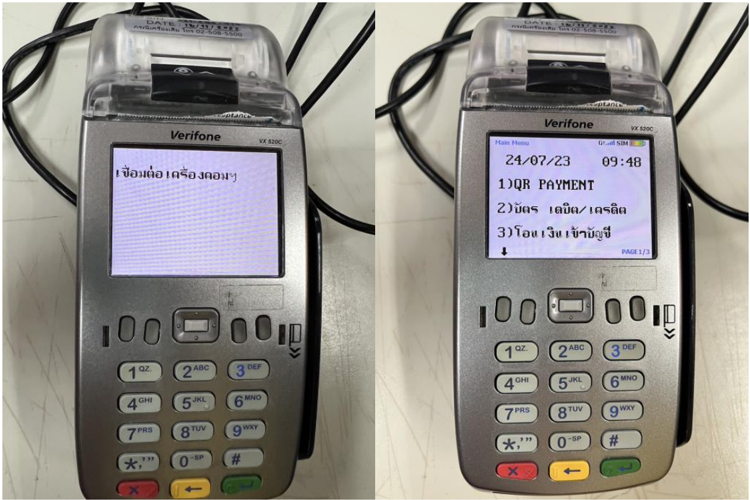

รูป 1-1 หน้าจอเครื่อง EDC พร้อมใช้งาน

## 2. การเข้าใช้งานระบบงานการเงินรับ (MIS2)

2.1 เจ้าหน้าที่ผู้ใช้งานต้องเข้าใช้งาน ผ่านระบบ Single Sign On และเลือกระบบงาน MIS2 ดังรูป 2-1

รูป 2-1 หน้าจอ แสดงการเลือกระบบเข้าใช้งาน

2.2 เลือกระบบงานที่ต้องการใช้งาน &lt; ระบบงานการเงินรับ &gt; จะปรากฏ หน้าจอหลัก ระบบงานการเงินรับ ดังรูป 2-2

รูป 2-2 หน้าจอหลัก ระบบงานการเงินรับ

## 3. การเข้าใช้งานโปรแกรมการรับเงินรายได้จากใบแจ้งการชำระ

เลือกเมนู &lt; บันทึก / แก้ไขข้อมูล &gt; จากนั้นเลือกเมนู &lt; รับเงินรายได้จากใบแจ้งการชำระ &gt; ดัง รูป 3-1 จะปรากฏหน้าจอโปรแกรมรับเงินรายได้จากใบแจ้งการชำระ ดังรูป 3-2

รูป 3-1 เมนูรับเงินรายได้จากใบแจ้งการชำระ

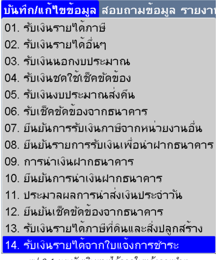

รูป 3-2 หน้าจอโปรแกรมรับเงินรายได้จากใบแจ้งการชำระ

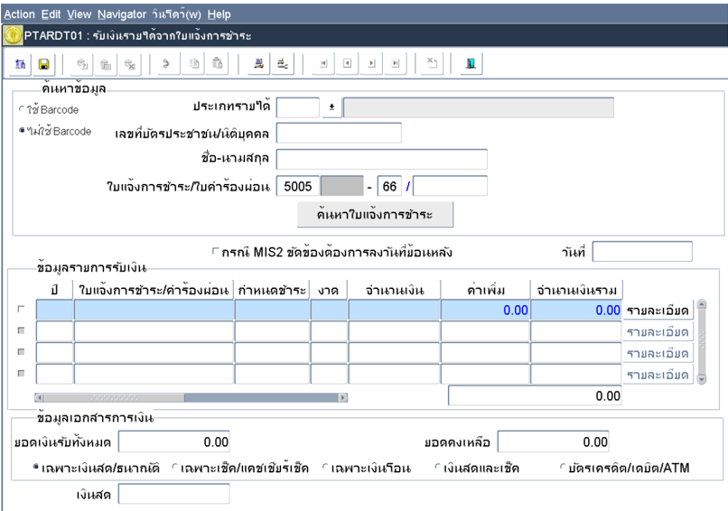

## 4. การตรวจสอบความพร้อมใช้งาน เครื่อง EDC กับโปรแกรมรับเงิน

ตรวจสอบเครื่อง EDC พร้อมใช้งานกับโปรแกรมรับเงินรายได้จากใบแจ้งการชำระหรือไม่ ดังรูป 4-1

- 4.1 เลือกประเภทการรับเงิน เป็น ' บัตรเครดิต / เดบิต /ATM ' จากข้อมูลเอกสารการเงิน 4.2 กดปุ่ม &lt; ทดสอบเครื่อง EDC&gt;
- 4.3 จะปรากฏข้อความ ' เครื่อง EDC พร้อมใช้งาน ' แสดงว่าเครื่อง EDC กับโปรแกรมรับเงิน รายได้จากใบแจ้งการชำระ พร้อมใช้งานแล้ว

รูป 4-1 หน้าจอระบบทดสอบเครื่อง EDC พร้อมใช้งาน

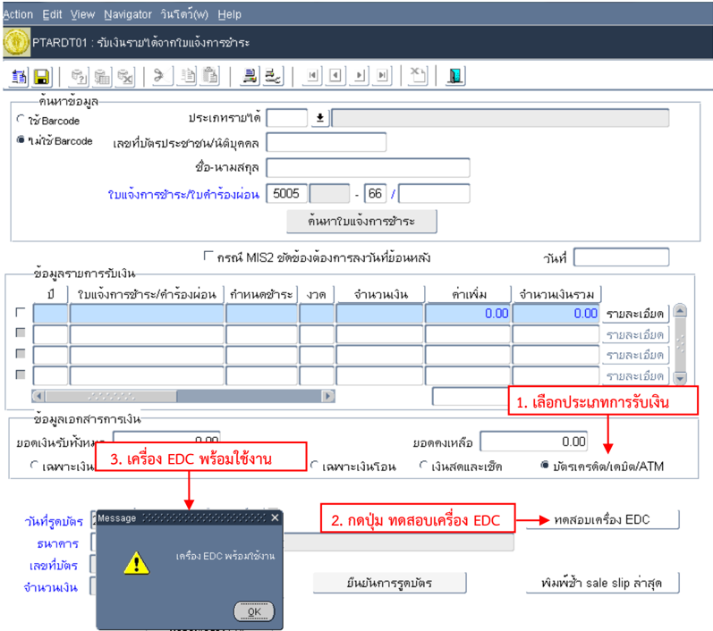

## 5. การค้นหาใบแจ้งการชำระ

การค้นหาใบแจ้งการชำระ สามารถค้นหาได้ตามเงื่อนไข ดังรูป 5-1 รายละเอียดดังนี้

- 5.1. ระบุข้อมูลประเภทรายได้ และต้องระบุข้อมูลที่ต้องการค้นหา อย่างน้อย 1 ใน 3 เงื่อนไข
- 5.2. ระบุ เลขที่บัตรประชาชน / นิติบุคคล ต้องระบุให้ครบ 13 หลัก
- 5.3. ระบุ ชื่อ -นามสกุล เจ้าของใบแจ้งการชำระ ระบุตัวอักษร ที่มีนัยสำคัญ ในการค้นหา เช่น การระบุชื่อบริษัท หรือระบุนามสกุล เข้าไป โปรแกรมจะค้นหาใบแจ้งการชำระ ที่มีชื่อบริษัท หรือ ที่มีนามสกุลเดียวกันกับที่ได้ระบุ หากระบุ ข้อมูลที่ไม่เฉพาะเจาะจงเข้าไป จะส่งผลให้ โปรแกรมต้องใช้เวลาในการค้นหามากขึ้น
- 5.4. ระบุ เลขที่ใบแจ้งการชำระ / ใบคำร้องผ่อน ต้องระบุให้ครบ 18 หลัก และต้องตรงกับใบแจ้ง การชำระที่ต้องการรับเงิน

รูป 5-1 หน้าจอ การค้นหาใบแจ้งการชำระ

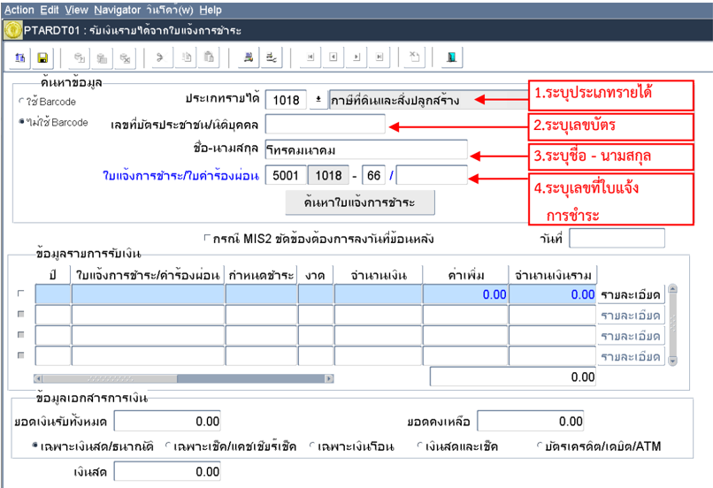

- 5.5. กดปุ่ม &lt; ค้นหาใบแจ้งการชำระ &gt; ซึ่งโปรแกรมจะค้นหาใบแจ้งการชำระตามเงื่อนไขที่ระบุ พร้อมตรวจสอบ สถานะของใบแจ้งการชำระที่พร้อมรับเงิน และไม่เลยกำหนดชำระ ผลการ ค้นหา มีรายละเอียดดังนี้
- 5.5.1. กรณีพบข้อมูลใบแจ้งการชำระพร้อมรับเงิน ระบบจะแสดงข้อมูล ดังรูป 5-2
- 5.5.2. กรณีพบใบแจ้งการชำระ ที่รับชำระเงินแล้ว โปรแกรมจะแสดงข้อมูล เลขที่ใบแจ้งการ ชำระ, หน่วยงานรับเงิน , วันที่รับเงิน , เลขที่ใบเสร็จ , จำนวนเงิน ดังรูป 5-3

รูป 5-2 หน้าจอผลการค้นหาใบแจ้งการชำระ

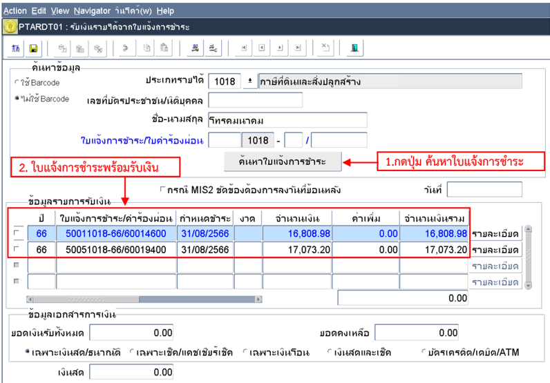

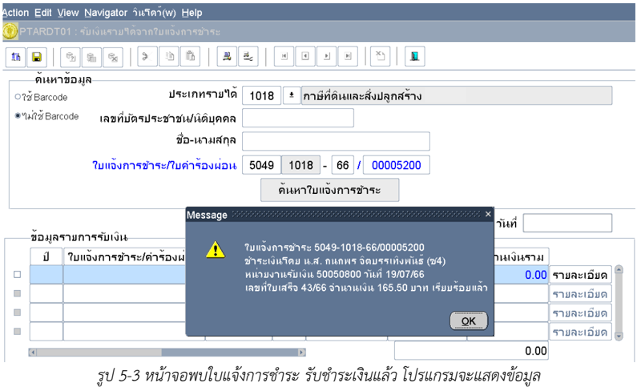

## 5.5.3. กรณีพบใบแจ้งการชำระ ที่รับชำระเงินแล้ว แต่อยู่ระหว่างการยืนยันข้อมูลจากธนาคาร เพื่อออกใบเสร็จรับเงิน โปรแกรมจะแสดงข้อมูล เลขที่ใบแจ้งการชำระ , วันที่รับเงิน , จำนวนเงิน ดังรูป 5-4

รูป 5-4 หน้าจอพบใบแจ้งการชำระ รับชำระเงินแล้ว แต่อยู่ระหว่างการยืนยันข้อมูลจากธนาคาร

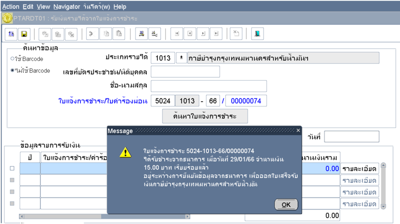

5.5.4. กรณีพบใบแจ้งการชำระ ที่ถูกยกเลิกแล้ว โปรแกรมจะแสดงข้อมูล เลขที่ใบแจ้งการ ชำระ ที่ถูกยกเลิก ดังรูป 5-5

รูป 5-5 หน้าจอพบใบแจ้งการชำระ ถูกยกเลิก

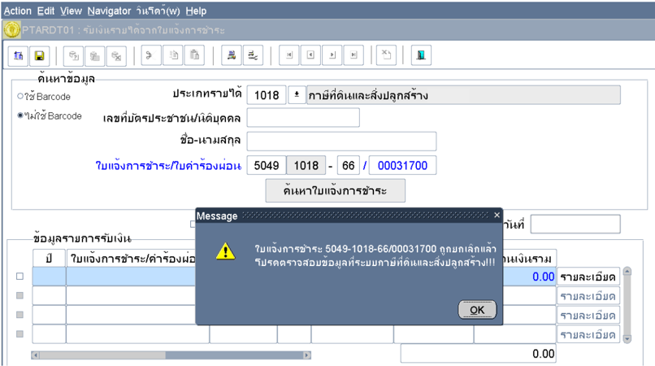

## 5.5.5. กรณีพบใบแจ้งการชำระ ที่เลยกำหนดการรับชำระ โปรแกรมจะแสดงข้อมูล เลขที่ใบ แจ้งการชำระ , วันที่ครบกำหนดชำระ ดังรูป 5-6

รูป 5-6 หน้าจอพบใบแจ้งการชำระ เลยกำหนดชำระ โปรแกรมจะแสดงข้อมูล

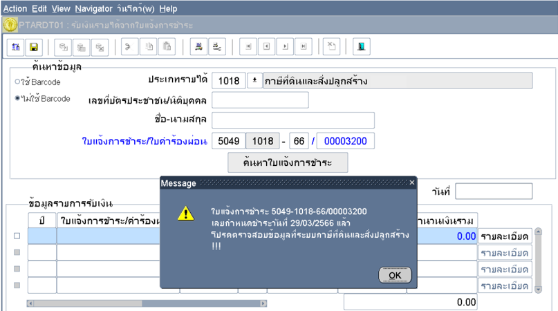

## 5.5.6. กรณีไม่พบใบแจ้งการชำระ ตามที่ได้ระบุเลขที่ใบแจ้งการชำระ โปรแกรมจะแสดง ข้อมูล เลขที่ใบแจ้งการชำระ ที่ไม่พบ ดังรูป 5-7

รูป 5-7 หน้าจอไม่พบใบแจ้งการชำระ ตามที่ได้ระบุเลขที่ใบแจ้งการชำระ

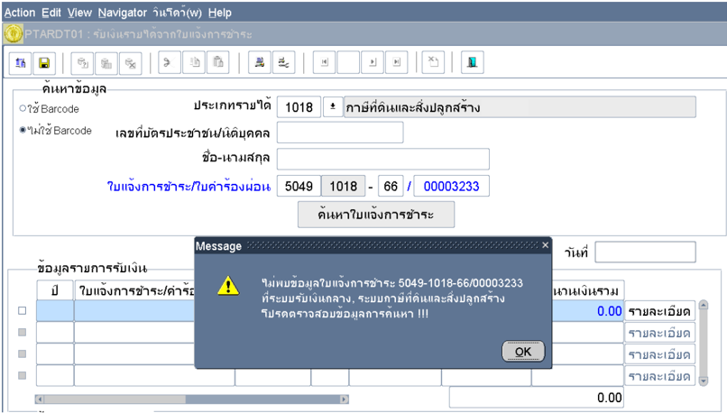

## 5.5.7. กรณีไม่พบใบแจ้งการชำระ ตามที่ได้ระบุเลขที่บัตรประชาชน/เลขที่นิติบุคคล โปรแกรม จะแสดงข้อมูล เลขที่บัตรประชาชน/เลขที่นิติบุคคล ที่ไม่พบ ดังรูป 5-8

รูป 5-8 หน้าจอไม่พบใบแจ้งการชำระ ตามที่ได้ระบุเลขที่บัตรประชาชน/เลขที่นิติบุคคล

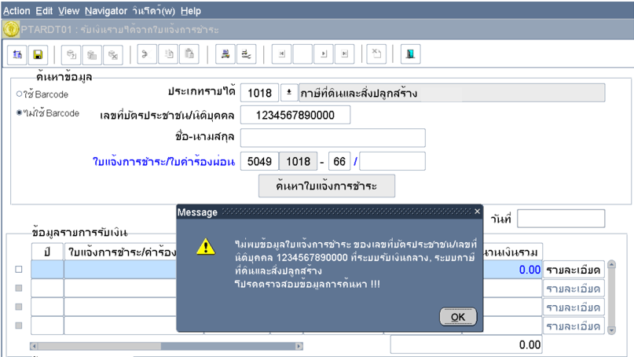

5.5.8. กรณีไม่พบใบแจ้งการชำระ ตามที่ได้ระบุชื่อ -นามสกุล โปรแกรมจะแสดงข้อมูล ชื่อ -นามสกุล ที่ไม่พบดังรูป 5-9

รูป 5-9 หน้าจอไม่พบใบแจ้งการชำระ ตามที่ได้ระบุชื่อ -นามสกุล

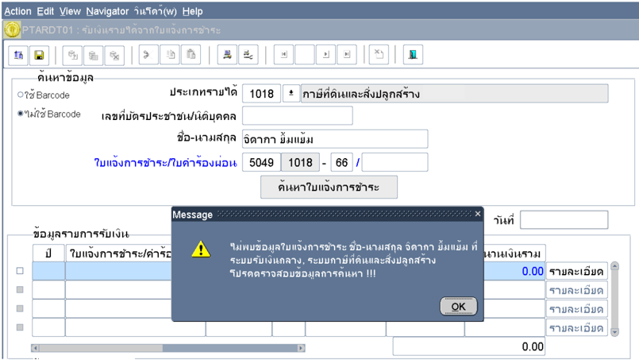

5.5.9. กรณีพบข้อมูลที่ใบแจ้งชำระมีข้อมูลไม่ครบถ้วน (เฉพาะในการรับชำระภาษีที่ดินและสิ่ง ปลูกสร้าง) เช่น ที่อยู่ , เลขที่หนังสือแจ้งการประเมิน , วันที่หนังสือแจ้งการประเมิน โปรแกรมจะแสดงข้อมูล เลขที่ใบแจ้งการชำระ ที่พบข้อมูลไม่ครบถ้วน ดังรูป 5-10

รูป 5-10 หน้าจอพบข้อมูลไม่ครบถ้วน มีเฉพาะการรับชำระภาษีที่ดินและสิ่งปลูกสร้าง

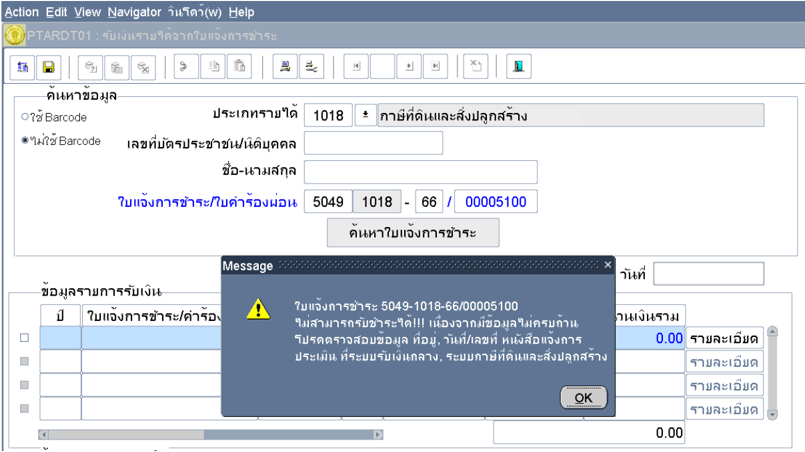

## 6. การรับเงิน

การรับเงิน ทุกประเภทรายได้ สามารถเลือกประเภทรับเงินได้ 5 ประเภท ดังนี้

- 1. เฉพาะเงินสด / ธนาณัติ
- 2. เฉพาะเช็ค / แคชเชียร์เช็ค
- 3. เฉพาะเงินโอน
- 4. เงินสดและเช็ค
- 5. บัตรเครดิต / เดบิต /ATM

## 6.1. การรับเงินด้วย QR Code

- 6.1.1. ระบุเลขที่ใบแจ้งการชำระ ที่ต้องการรับเงิน จากข้อมูลรายการรับเงิน สามารถระบุได้ มากกว่า 1 ใบแจ้งการชำระ ดังรูป 6-1
- 6.1.2. ระบุประเภทการรับเงิน เป็น ' เฉพาะเงินโอน ' จากข้อมูลเอกสารการเงิน สามารถระบุ ได้ 1 ประเภทการรับเงิน ดังรูป 6-1
- 6.1.3. กดปุ่ม 'สร้าง QR Code และพิมพ์ S lip' ดังรูป 6-1

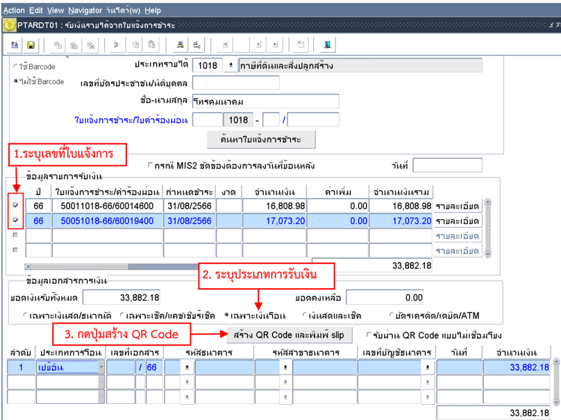

รูป 6-1 หน้าจอการรับเงินรายได้จากใบแจ้งการชำระ

## 6.1.4. เครื่อง EDC จะพิมพ์ THAI QR PAYMENT ตามข้อมูล REF1, REF2 , ยอดเงินที่ต้องรับ ทั้งหมด ตามที่ได้ระบุไว้ ดังรูป 6-2

รูป 6-2 THAI QR PAYMENT Slip

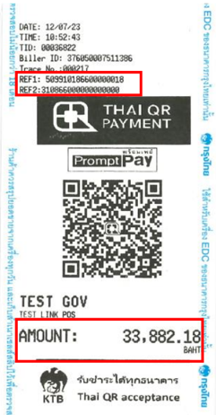

- 6.1.5. ฉีก THAI QR PAYMENT Slip ส่งให้ประชาชน Scan จ่ายเงิน หรือ ให้ประชาชน Scan จ่ายเงิน จาก THAI QR PAYMENT Slip ที่เครื่อง EDC
- 6.1.6. โปรแกรมจะแสดงหน้าจอ พร้อมรับเงินจากการ Scan จ่าย จากประชาชน ดังรูป 6-3

รูป 6-3 หน้าจอ พร้อมรับเงินจากการ Scan จ่าย จากประชาชน

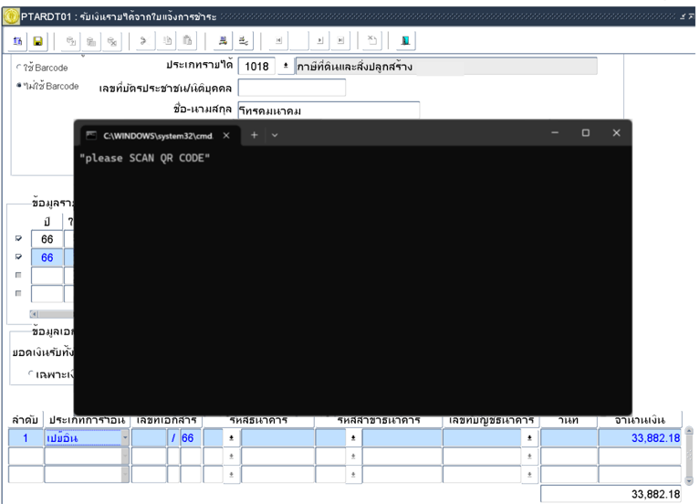

- 6.1.7. รอ กดปุ่มสีแดง หรือ กดปุ่มสีเขียว ที่เครื่อง EDC เท่านั้น
- 6.1.8. ให้ กดปุ่มสีแดง หากประชาชน ไม่ได้ Scan จ่าย หรือแจ้งยกเลิกการ Scan จ่าย

ดังรูป

6-4

รูป 6-4 ตำแหน่งกดปุ่มสีแดง ที่เครื่อง EDC

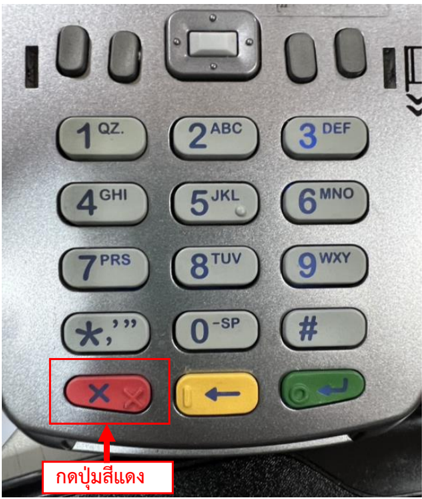

## 6.1.9. ให้ กดปุ่มสีเขียว หากประชาชน Scan จ่าย เรียบร้อยแล้ว ดังรูป 6-5

รูป 6-5 ตำแหน่งกดปุ่ม สีเขียว ที่เครื่อง EDC

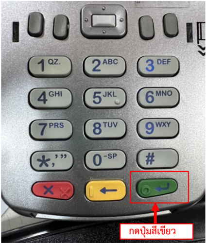

## 6.1.10. โปรแกรมรับเงิน จะตรวจสอบรายการที่ประชาชน Scan จ่าย หากตรวจสอบพบ รายการที่ Scan จ่าย โปรแกรมรับเงิน จะแสดงรายละเอียดให้โดยอัตโนมัติ ดังนี้ 6.1.10.1. แจ้งบันทึกรายการรับเงินสำเร็จ ดังรูป 6-6

รูป 6-6 แจ้งบันทึกรายการรับเงินสำเร็จ

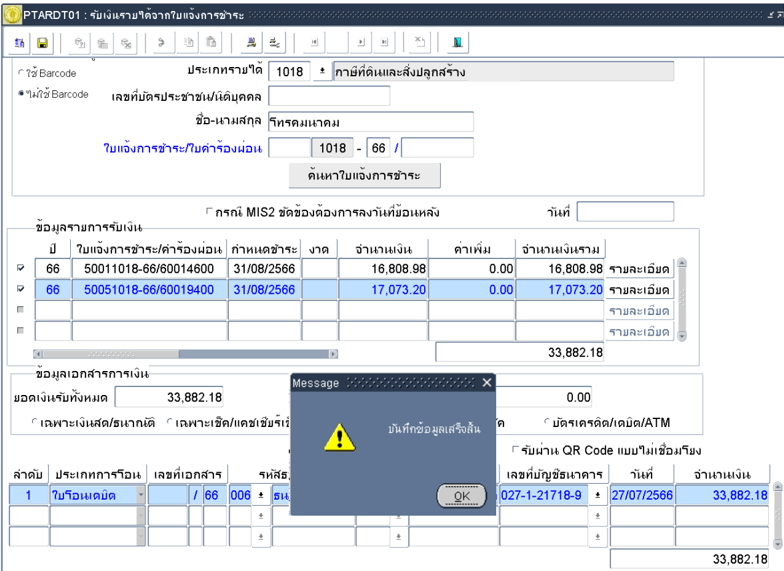

## 6.1.10.2. ออกใบเสร็จรับเงิน ดังรูป 6-7

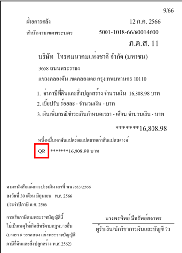

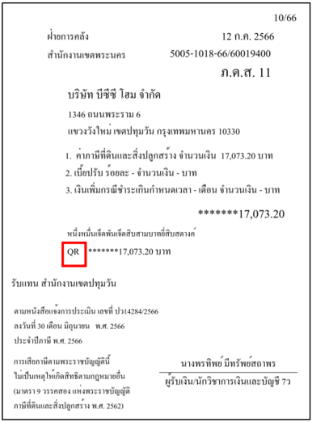

รูป 6-7 ออกใบเสร็จรับเงิน

## 6.1.10.3. พิมพ์ Sale Slip รายการที่ถูก Approve ที่เครื่อง EDC ดังรูป 6-8

รูป 6-8 Sale Slip รายการที่ถูก Approve ที่เครื่อง EDC

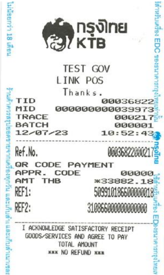

## 6.1.11. ฉีก Sale Slip รายการที่ถูก Approve แนบคู่กับ THAI QR PAYMENT Slip

ดังรูป 6-9

รูป 6-9 Sale Slip รายการที่ถูก Approve แนบคู่กับ THAI QR PAYMENT Slip

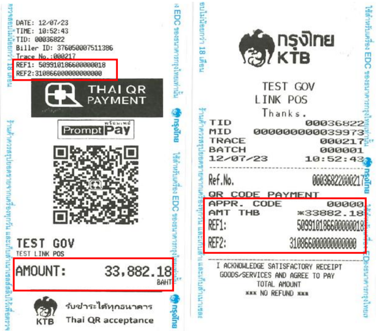

## 6.2 การรับเงินด้วย บัตรเครดิต/เดบิต/ ATM

6.3.1. โปรแกรม หน้าจอการเลือกข้อมูลรายการรับเงิน ช่อง ' บัตรเครดิต / เดบิต /ATM '

- 6.3.10.1. ระบุเลขที่ใบแจ้งการชำระ ที่ต้องการรับเงิน จากข้อมูลรายการรับเงิน สามารถระบุได้มากกว่า 1 ใบแจ้งการชำระ ดังรูป 6-10
- 6.3.10.2. ระบุประเภทการรับเงิน เป็น ' บัตรเครดิต / เดบิต /ATM ' ดังรูป 6 -1 0
- 6.3.10.3. ระบุธนาคาร โดยกดปุ่ม เพื่อรับชำระเงินผ่านบัตรเครดิต / เดบิต /ATM ดังรูป 6-10

6.3.10.4. กดปุ่ม ' ยืนยันการรูดบัตร ' ดังรูป 6-10

รูป 6-10 หน้าจอเลือกข้อมูลรายการรับเงิน ช่อง ' บัตรเครดิต / เดบิต / ATM'

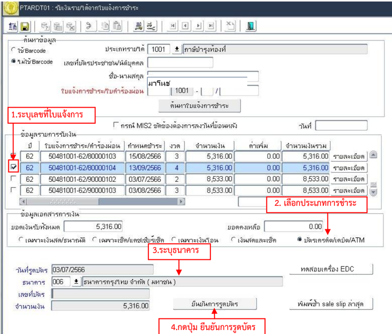

## 6.3.2. โปรแกรมจะแสดงหน้าจอ พร้อมชำระเงินผ่าน ' บัตรเครดิต / เครดิต /ATM ' ดังรูป 6-11

รูป 6-11 หน้าจอพร้อมรับเงินจากบัตร จากประชาชน

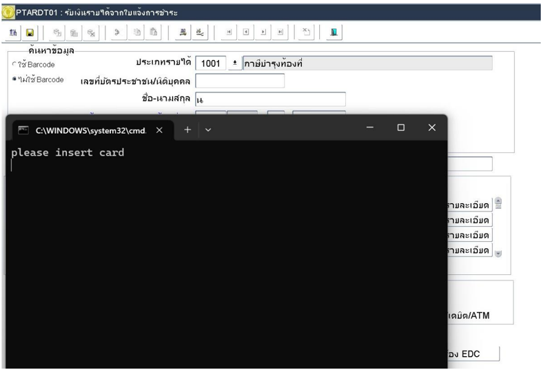

6.3.3. เครื่อง EDC จะปรากฏ ข้อความ ดังรูป 6-12 ให้ผู้ใช้งานทำการรูดบัตร ' บัตรเครดิต / เครดิต /ATM ' บนเครื่อง EDC

รูป 6 -1 2 หน้าจอเครื่อง EDC แสดงข้อความ เพื่อสร้าง QR Code

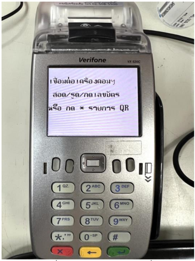

6.3.4. ' กรณีรูดด้วยบัตร เดบิตหรือบัตร ATM ' เครื่อง EDC จะปรากฏ หน้าจอ ให้ใส่รหัส ของผู้รับชำระ ดังรูป 6-13 ' กรณีบัตรเครดิต ' ให้ทำขั้นตอน ดังรูป 6-14

รูป 6 -1 3 หน้าจอเครื่อง EDC แสดงข้อความ ใส่รหัสบัตรเครดิต / เดบิต /ATM

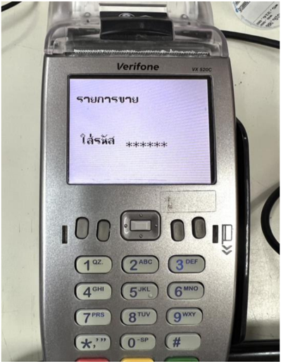

6.3.5. เมื่อระบุรหัสผ่าน เรียบร้อยแล้ว เครื่อง EDC จะปรากฏ หน้าจอ รายละเอียดข้อมูลบัตร เดบิต / เครดิต และยอดรายการที่ต้องการรับชำระ จากนั้น กดปุ่ม สีเขียว ดังรูป 6-14

รูป 6 -1 4 หน้าจอเครื่อง EDC แสดงรายละเอียดข้อมูลบัตรเดบิต / เครดิต

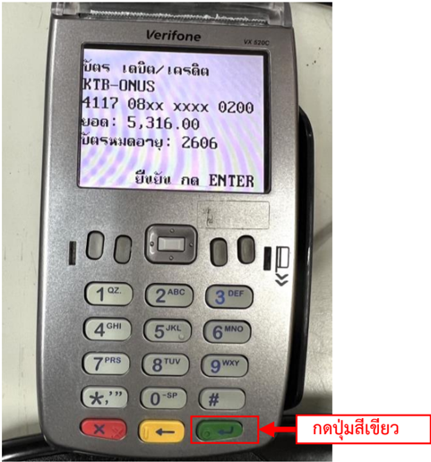

6.3.6. เมื่อทำการ กดปุ่ม Enter ในเครื่อง EDC หรือปุ่มสีเขียว เรียบร้อยแล้ว เครื่อง EDC จะ ทำการประมวลผลรับข้อมูล ดังรูป 6-15 เมื่อเสร็จสิ้น เครื่องจะประมวลผล แสดง ข้อความ ' รายการสำเร็จ ' ดังรูป 6-16

รูป 6 -15 หน้าจอเครื่อง EDC แสดงรายละเอียดข้อมูลบัตรเดบิต / เครดิต

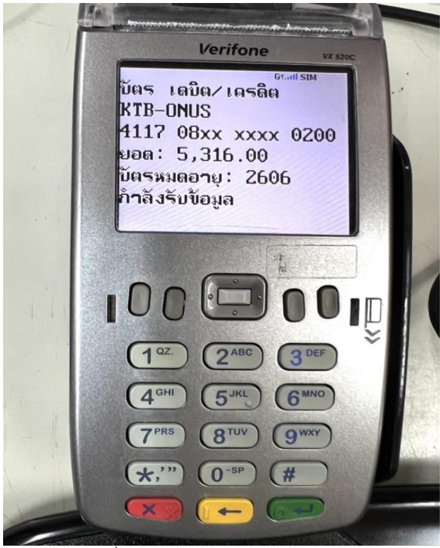

รูป 6 -1 6 หน้าจอเครื่อง EDC แสดงรายการสำเร็จ

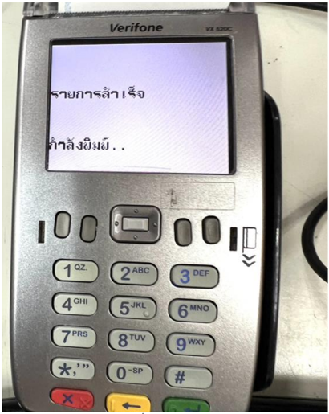

## 6.3.7. ตรวจสอบข้อมูลเพื่อยืนยันบัตรอีกครั้ง จากนั้น ทำการกดปุ่ม ยืนยัน สีเขียว เพื่อทำการ พิมพ์สำเนา Sale Slip ให้ผู้ชำระ ดังรูป 6-17

รูป 6 -17 หน้าจอเครื่อง EDC พิมพ์ใบเสร็จสำหรับผู้ชำระ

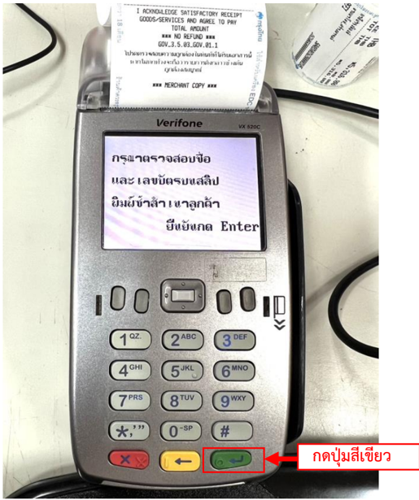

6.3.8. พิมพ์ Sale Slip รายการที่ถูก Approve ที่เครื่อง EDC 6.3.10.1. ' ส่วนที่ 1 เก็บไว้เป็นหลักฐานให้หน่วยงาน ให้ผู้ชำระ กรอกลายเซ็นกำกับใน ส่วน Signature ใน Sale Slip ' ดังรูป 6-18 6.3.10.2. ' ส่วนที่ 2 เป็นสำเนา Sale Slip ที่ต้อง ยื่นให้แก่ผู้ชำระ ' ดังรูป 6-18

รูป 6 -18 หน้าจอเครื่อง EDC แสดงรายละเอียดข้อมูลบัตรเดบิต / เครดิต

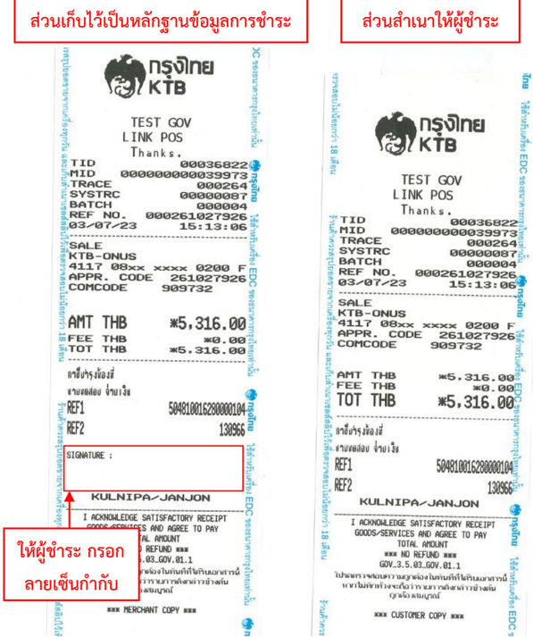

6.3.9. หลังจากเครื่อง EDC สร้างใบเสร็จรับเงิน /Sale Slip เรียบร้อย ในส่วนโปรแกรม รับเงิน รายได้จากใบแจ้งการชำระ โปรแกรมแสดงข้อความ ' บันทึกข้อมูลเสร็จสิ้น ' และระบบ จะทำการสร้างใบเสร็จในระบบให้อัตโนมัติ ดังรูป 6-19 และ รูป 6-20

รูป 6 -19 หน้าจอข้อมูลรายการรับเงิน พิมพ์ QR Code เสร็จสิ้น

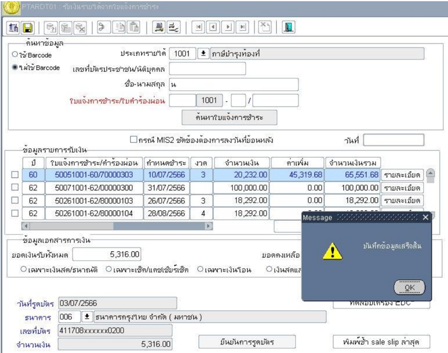

รูป 6 -20 ใบเสร็จในระบบงานการเงินรับ

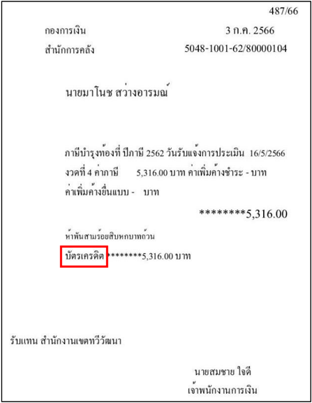

## 6.3 การรับเงินผ่าน QR Code แบบไม่เชื่อมโยง

## 6.3.1 ตรวจการรับเงิน ผ่าน QR Code แบบไม่เชื่อมโยง

- 6.3.1.1 ตรวจสอบการรับเงินผ่าน QR Code แบบไม่เชื่อมโยง ผู้ใช้งาน จะต้องทำการ ตรวจสอบการชำระเงินผ่าน เครื่อง EDC
- 6.3.1.2 จากหน้าจอ เครื่อง EDC ให้ผู้ใช้งานเลือก ข้อ 1) QR PAYMENT กดหมายเลข 1 ที่เครื่อง EDC ดังรูป 6-21
- 6.3.1.3 เมื่อกดหมายเลข 1 เรียบร้อยแล้ว ให้ผู้ใช้งานเลือก ข้อ 3) ตรวจสอบการชำระเงิน กดหมายเลข 3 ที่เครื่อง EDC จะปรากฏ หน้าจอ ดังรูป 6-22
- 6.3.1.4 เมื่อกดหมายเลข 3 เรียบร้อยแล้ว ให้นำเลข Trace No. ใน Sale Slip ไป ตรวจสอบโดยใส่หมายเลขสลิป ( Trace No) จากนั้น กดปุ่มสีเขียว เพื่อยืนยันการ ตรวจสอบ จะปรากฏ หน้าจอ ดังรูป 6-23
- 6.3.1.5 เมื่อผู้ชำระ ชำระเรียบร้อย เครื่อง EDC จะปรากฏ ดังรูป 6.24
- 6.3.1.6 ผู้ใช้งาน ทำการบันทึกการรับเงิน ผ่าน QR Code ได้ตามข้อ 6.3.2
- 6.3.1.7 เมื่อผู้ชำระ ชำระไม่สำเร็จ เครื่อง EDC จะปรากฏ ดังรูป 6.25
- 6.3.1.8 ผู้ใช้งาน แจ้งรายการชำระเงินไม่เสร็จ กับผู้ชำระภาษี เพื่อตรวจสอบการโอนเงิน

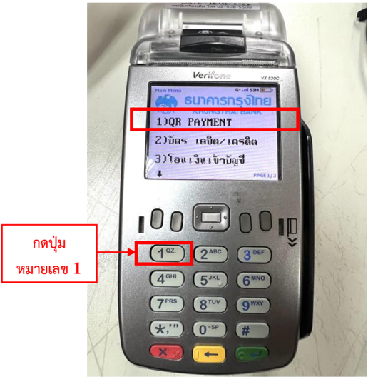

รูป 6 -21 หน้าจอเริ่มตรวจสอบการชำระเงิน

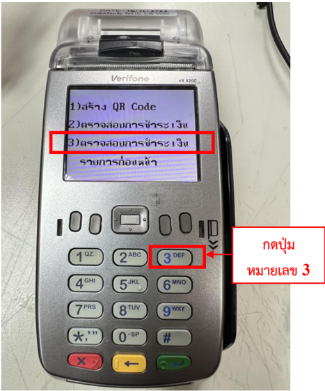

รูป 6 -22 หน้าจอเริ่มตรวจสอบการชำระเงิน

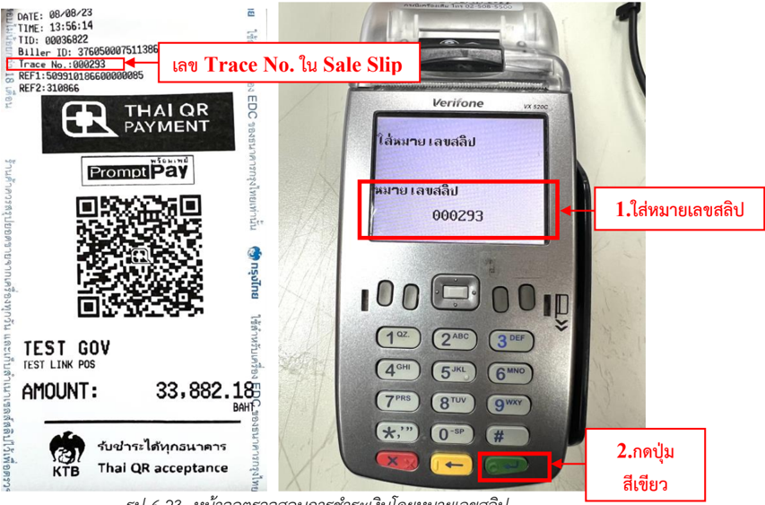

รูป 6 -23 หน้าจอตรวจสอบการชำระเงินโดยหมายเลขสลิป

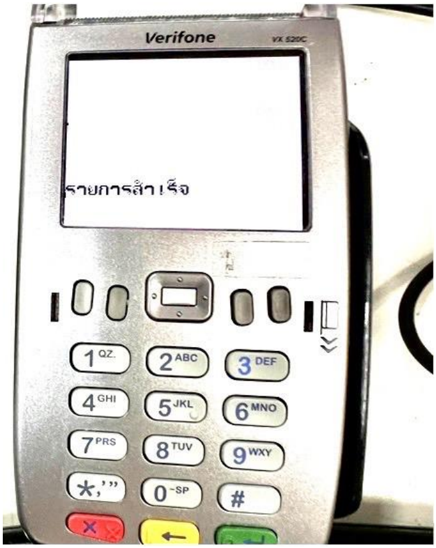

รูป 6 -24 หน้าจอตรวจสอบการชำระเงิน รายการสำเร็จ

รูป 6 -25 หน้าจอตรวจสอบการชำระเงิน รายการไม่สำเร็จ

## 6.3.2 บันทึกการรับเงิน ผ่าน QR Code แบบไม่เชื่อมโยง

- 6.3.2.1 โปรแกรม หน้าจอการเลือกข้อมูลรายการรับเงิน ช่อง ' เฉพาะเงินโอน ' กรณี ' รับผ่าน QR Code แบบไม่เชื่อมโยง '
- 6.3.2.2 ค้นหาใบแจ้งการชำระ สามารถระบุได้มากกว่า 1 ข้อมูล  ที่ต้องการรับเงิน จากนั้น กดปุ่ม ' ค้นหาใบแจ้งชำระ ' ดังรูป 6-26
- 6.3.2.3 เลือก ' ข้อมูลรายการรับเงิน ' สามารถระบุได้มากกว่า 1 ใบแจ้งการชำระ ดังรูป 6-26
- 6.3.2.4 ระบุประเภทการรับเงิน เป็น ' เฉพาะเงินโอน ' จากข้อมูลเอกสารการเงิน สามารถ ระบุได้ 1 ประเภทการรับเงิน ดังรูป 6-26
- 6.3.2.5 กดช่อง 'รับผ่าน QR Code แบบไม่เชื่อมโยง ' ดังรูป 6-26
- 6.3.2.6 กดปุ่ม บันทึกข้อมูล ระบบจะออกเลขที่เอกสาร ดังรูป 6-27 และพิมพ์ใบเสร็จให้ อัตโนมัติ ดังรูป 6-28

รูป 6 -26 หน้าจอเลือกข้อมูลรายการรับเงิน ช่อง ' เฉพาะเงินโอน ' กรณี ' รับผ่าน QR Code แบบไม่เชื่อมโยง '

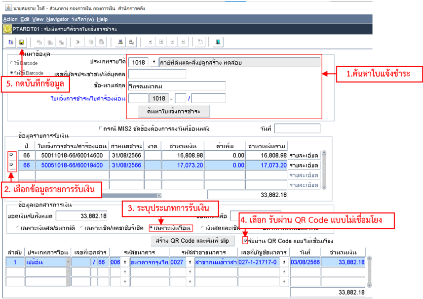

รูป 6 -27 หน้าจอข้อมูลรายการรับเงิน กรณี ' รับผ่าน QR Code แบบไม่เชื่อมโยง ' เสร็จสิ้น

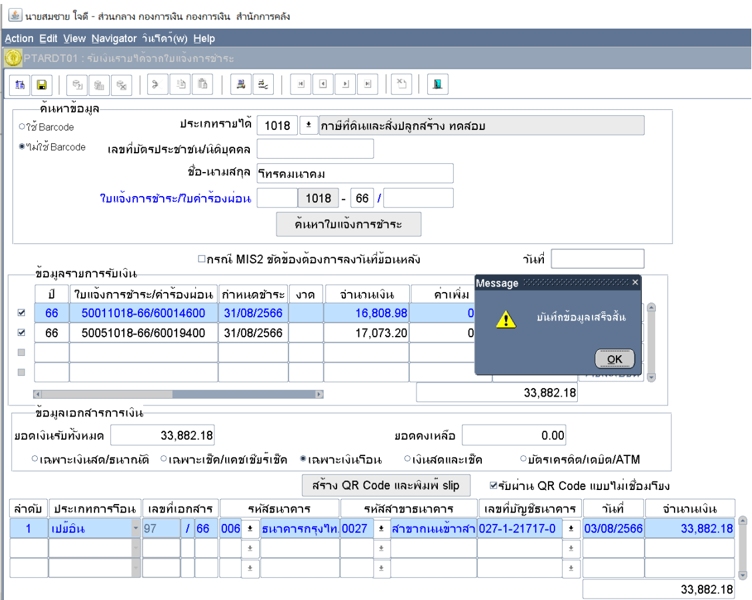

รูป 6 -28 ใบเสร็จในระบบงานการเงินรับ

## รายงานที่เกี่ยวข้องกับ เครื่องรูดบัตร EDC ระบบการเงินรับ

## รายงานที่เกี่ยวข้องกับ เครื่องรูดบัตร EDC ระบบการเงินรับ

รายงานที่เกี่ยวข้องกับการใช้งานร่วมกับเครื่องรูดบัตร EDC ระบบการเงินรับ อยู่ในส่วนเมนู

รายงานประจำวัน เลือกเมนูหัวข้อ ประกอบด้วย

- 1. รายงานการรับเงินด้วยบัตรเครดิต / เดบิต /ATM/QR
- 2. รายงานการรับเงินด้วยบัตรเครดิต / เดบิต /ATM/QR ตามประเภทรายได้

เมนูรายงาน เครื่องรูดบัตร EDC

## 1. รายงานการรับเงินด้วยบัตรเครดิต / เดบิต /ATM/QR

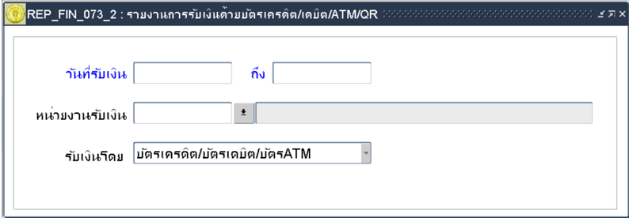

## รายละเอียดหน้าจอ

- 1. วันที่รับเงิน

- :

- ระบุวันที่รับเงิน

- 2. หน่วยงานรับเงิน

- :

ระบบแสดงข้อมูลอัตโนมัติ

- 3. รับเงินโดย :

เลือกประเภทการรับเงิน

วัตถุประสงค์ : เพื่อเรียกดูรายงานตามประเภทการรับเงิน บัตรเครดิต / เดบิต /ATM/QR

## ขั้นตอนการทำงาน

- 1. ระบุวันที่รับเงิน ที่ต้องการเรียกดูรายงานการรับเงินด้วยบัตรเครดิต / เดบิต /ATM/QR จากนั้นเลือกหน่วยงานรับเงิน ระบบจะแสดงข้อมูลอัตโนมัติในหน่วยงานที่ตรวจสอบ ผู้ใช้งาน สามารถเรียกดูหน่วยงานรับเงินอื่นได้โดยให้ คลิกปุ่ม ดังรูป

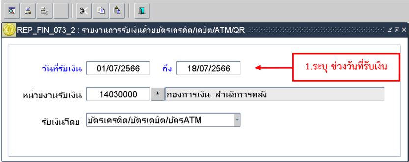

2. จากนั้นให้เลือกประเภทการรับเงินที่ต้องการ ดังรูป

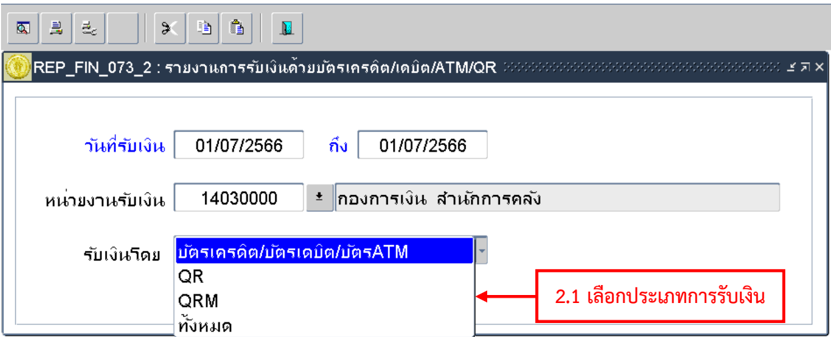

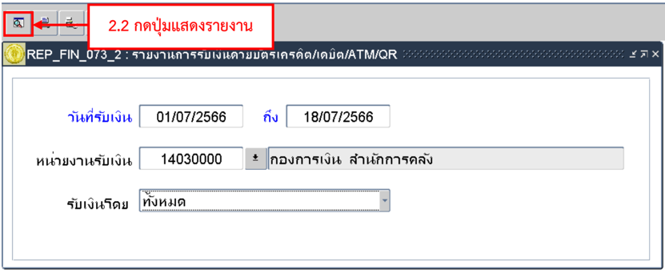

## ตัวอย่าง รายงานการรับเงินด้วยบัตรเครดิต / เดบิต /ATM/QR

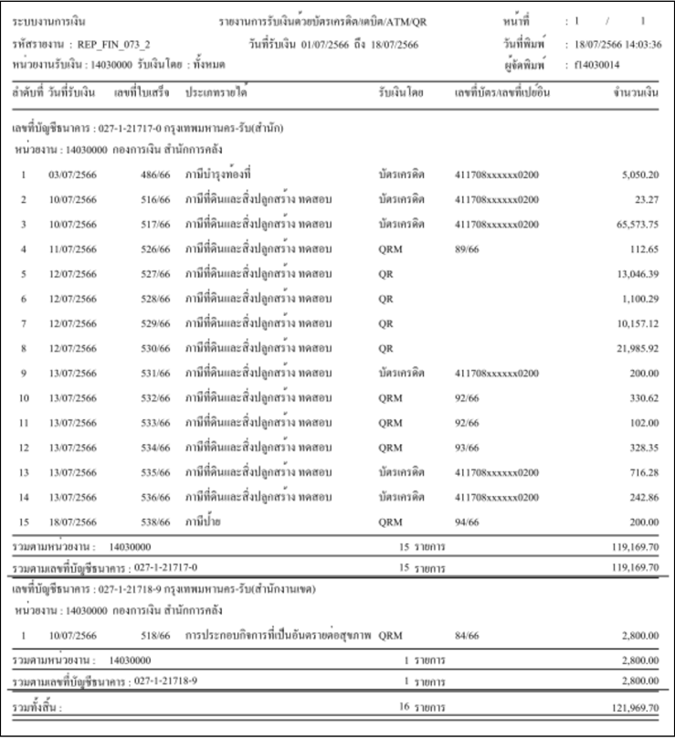

3. เมื่อต้องการออกจากหน้าจอหรือจบการทำงานให้ทำการกดปุ่ม ระบบจะแสดง แจ้งเตือนการออกจากโปรแกรม ถ้าไม่ต้องการออกจากหน้าจอพิมพ์รายงานให้กดยกเลิก แต่ถ้า ต้องการออกจากพิมพ์รายงาน ให้กดตกลง ดังรูป

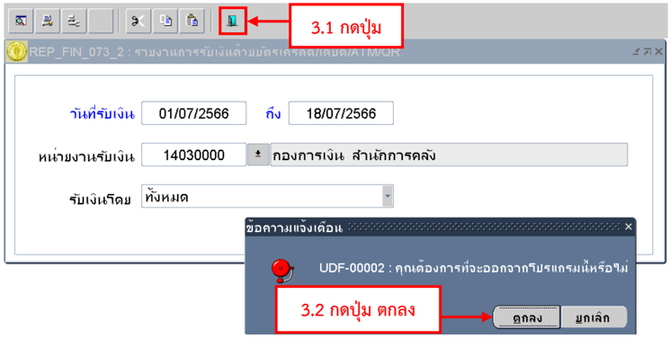

## 2. รายงานการรับเงินด้วยบัตรเครดิต / เดบิต /ATM/QR ตามประเภทรายได้

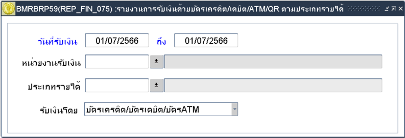

## รายละเอียดหน้าจอ

- 1. วันที่รับเงิน

- :

- ระบุวันที่รับเงิน

- 2. หน่วยงานรับเงิน :

ระบบแสดงข้อมูลอัตโนมัติ

- 3. ประเภทรายได้ :

- เลือกประเภทรายได้ โดยคลิปปุ่ม

- 4. รับเงินโดย :

- เลือกประเภทการรับเงิน

วัตถุประสงค์ : เพื่อเรียกดูรายงานการรับเงินด้วยบัตรเครดิต / เดบิต /QR ตามประเภทรายได้

## ขั้นตอนการทำงาน

- 1. ระบุวันที่รับเงิน ที่ต้องการเรียกดูรายงานการรับเงินด้วยบัตรเครดิต / เดบิต /QR ตาม

## ประเภทรายได้ ดังรูป

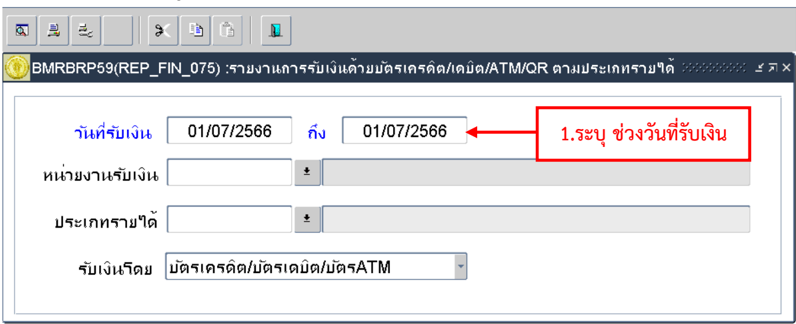

## 2 . เลือกหน่วยงานรับเงิน โดยคลิกปุ่ม ระบบจะแสดงรายชื่อหน่วยงานให้เลือก ดังรูป

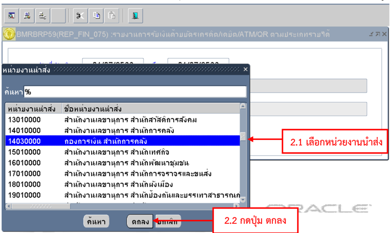

## 3 . เลือกประเภทรายได้ โดยคลิกปุ่ม ระบบจะแสดงรายการประเภทรายได้ให้เลือก

ดังรูป

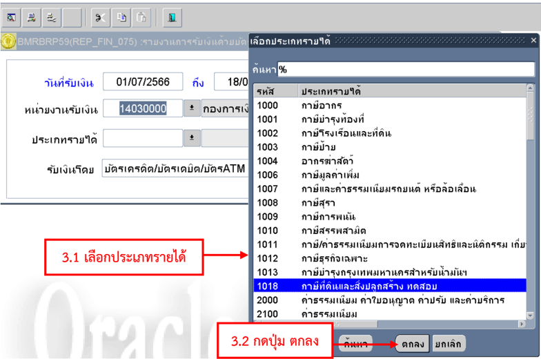

4 . เลือกประเภทการรับเงิน จากนั้นกดปุ่มเรียกดูรายงาน ดังรูป

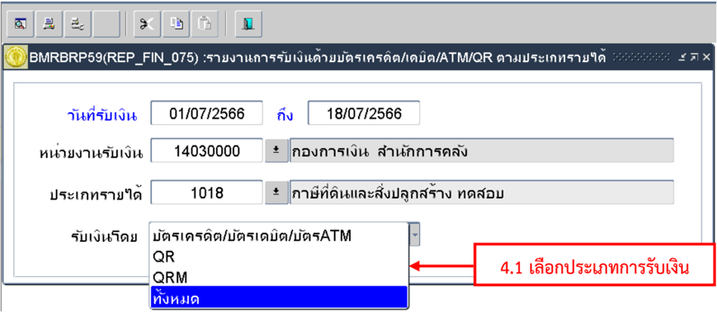

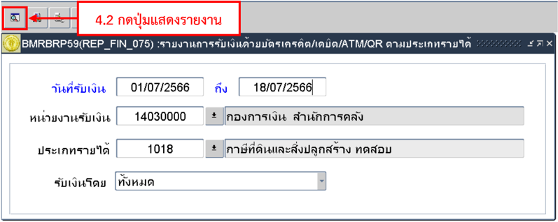

## ตัวอย่าง รายงานการรับเงินด้วยเครื่อง EDC ตามประเภทรายได้

5 .เมื่อต้องการออกจากหน้าจอหรือจบการทำงานให้ทำการกดปุ่ม ระบบจะแสดงแจ้งเตือน การออกจากโปรแกรม ถ้าไม่ต้องการออกจากหน้าจอพิมพ์รายงานให้กดยกเลิก แต่ถ้าต้องการออกจาก พิมพ์รายงาน ให้กดตกลง ตัวอย่างดังรูป

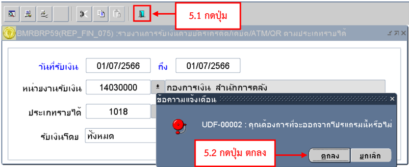
